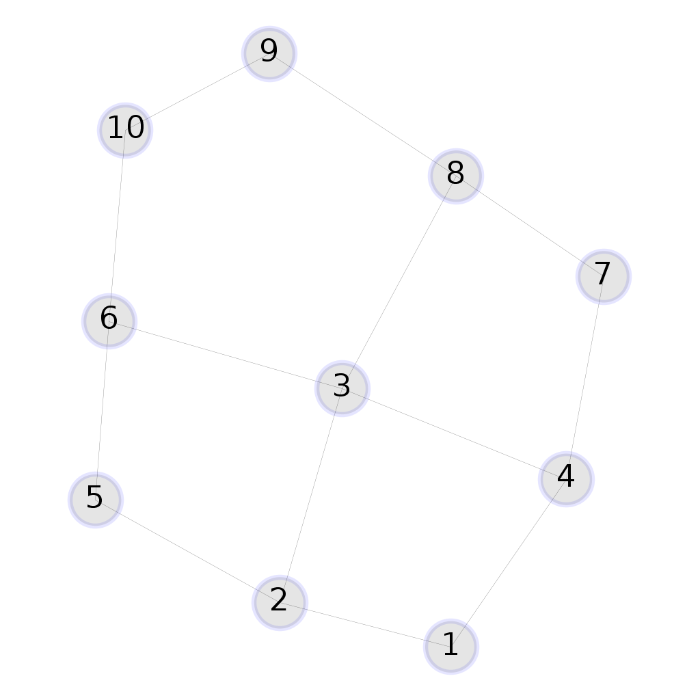

# Graph validation

A `Tiling` instance that represents a valid tessellation is a graph with the following properties:

* all nodes connected to at least 2 other nodes (degree >= 2) - otherwise, a node of degree 0 would represent an external point and a node of degree 1 an open polygon

> 
>
> _Invalid since node 4 has degree 1_

* all nodes connected to at most 6 other nodes (degree <= 6) - otherwise, a node would have 6 adjacent polygons (impossible since the polygon with the smaller exterior angle, the regular triangle, fills the full angle with 6 units)

> 
> 
>
> _Invalid since node 1 has degree 7_

* the graph is connected

> 
>
> _Invalid since nodes 1, 2, 3 are not connected to nodes 4, 5, 6_

* there exist no adjacent polygons at the same vertex

> 
>
> _Invalid due to polygons at node 2_

* there exist no adjacent polygons at the same vertex making more than a full circle

> 
> 
>
> _Invalid due to three squares and a regular pentagon at node 3 that make more than a full circle_

> 
> 
>
> _Invalid due to overlapping squares and a regular pentagon at node 3_

* there exist no overlapping areas

> 
> 
>
> _Invalid due to overlapping area_

> 
> 
>
> _Invalid due to overlapping area and sides: edges 2\~5 with 21\~19 and 3\~6 with 22\~17_

* there exist no overlapping sides

> 
> 
>
> _Invalid due to the overlapping sides 2\~5 and 24\~19_

* there exist no overlapping vertices

> 
> 
>
> _Invalid due to the overlapping vertexes 6 and 15_

* there exist no "inside gaps", they would be considered non-regular unit polygons

> 
> 
>
> _Invalid due to a gap_
